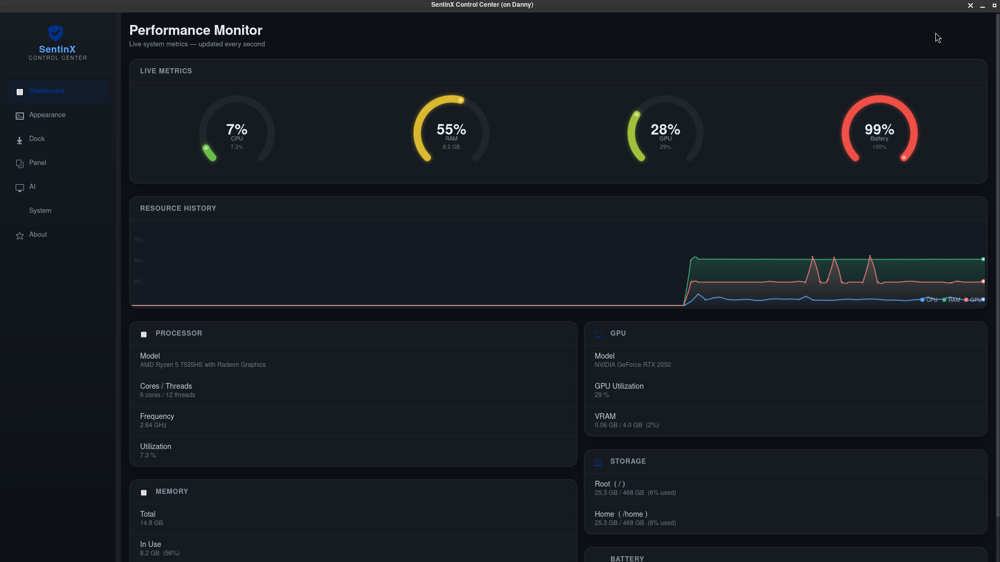
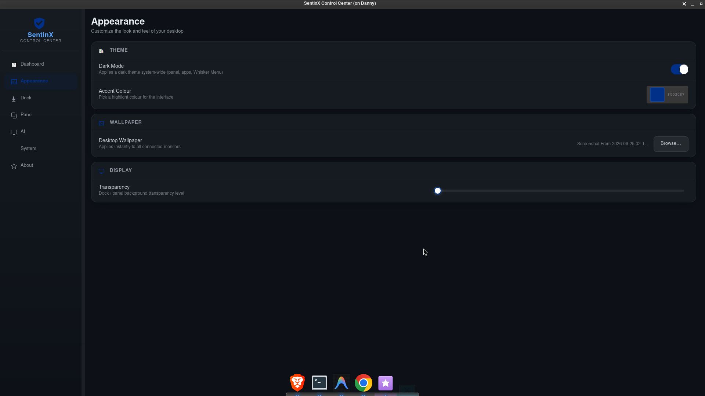
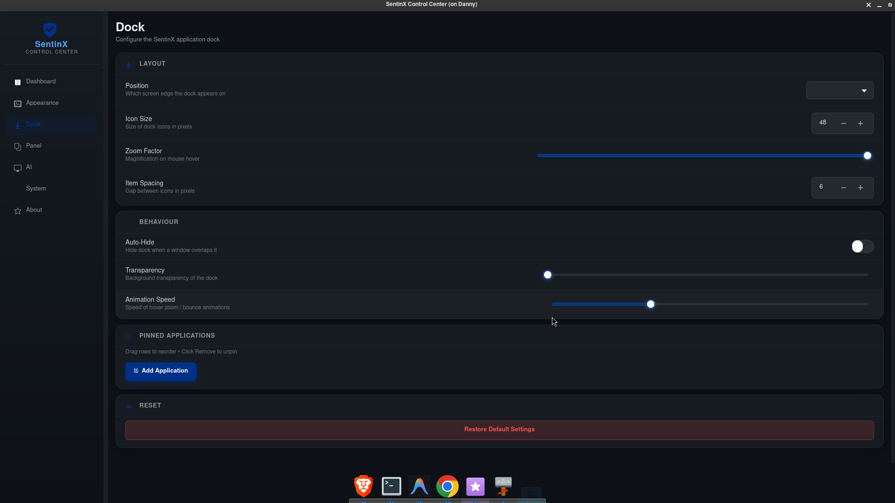
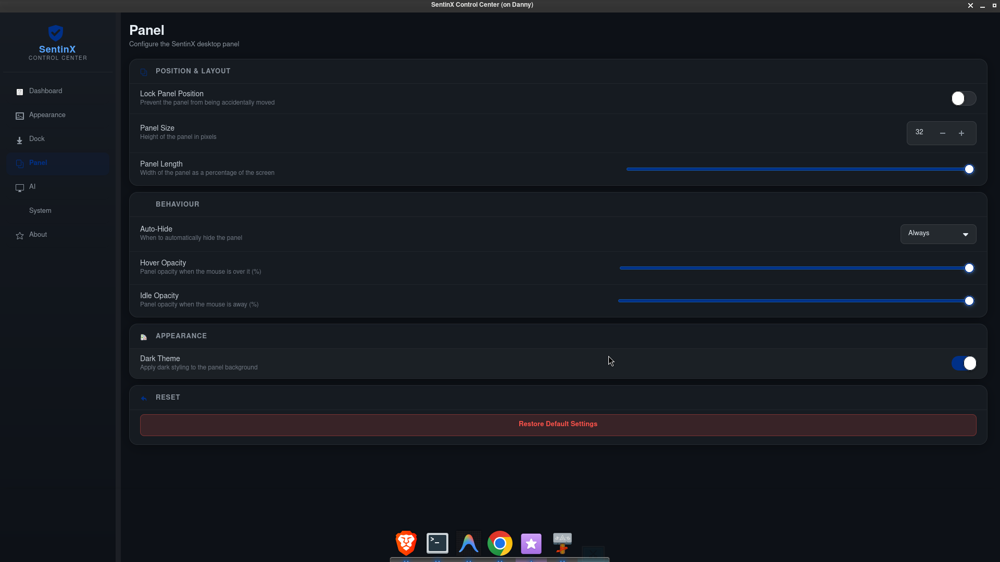

# SentinX Control Center

SentinX Control Center is a premium, custom GTK 4-based control panel designed specifically for SentinX OS. It features a modern dark glassmorphism design system, real-time performance diagnostics, and system-wide customizer pages.

---

## Key Features

### 1. 📈 Performance Monitor (Dashboard)
- **Cairo-based Circular Ring Gauges**: Real-time animated rings tracking CPU, memory, GPU, and battery levels, complete with neon outer glow layers and active tip indicators.
- **Scrolling Bezier Wave Graphs**: Smooth overlay graph scrolling CPU, RAM, and GPU history at ~30fps.
- **Live Metrics**: Detailed processor stats, VRAM allocations/usage (via `nvidia-smi`), storage utilization, and power diagnostics.

### 2. 🎨 Desktop Customization (Appearance)
- **Microsoft Paint-style Accent Color Picker**: Visual grid layout showing 36 curated swatches with corresponding hex code strings, dynamic hex-text overrides, and live swatch previews.
- **System-wide Theme Integration**: Instant toggles for dark/light mode across GTK themes, XFCE panels, and Whisker Menus.
- **Compositor Transparency Slider**: Controls XFWM4 active/inactive frame and window composition opacities directly.
- **Multi-Monitor Wallpaper Manager**: Scans Xrandr outputs to bind wallpaper changes instantly to all connected screens and workspaces.

### 3. ⚙️ Hardware Controls & Sudo Utilities (System)
- **Audio Volume Slider & Mute Toggle**: Real-time audio configuration synchronized via `pactl`.
- **Screen Brightness Slider**: Hardware brightness scaling mapped to active screens via X11 outputs.
- **Sudo Hostname Updater**: Secure graphical Polkit dialog wrapper (`pkexec hostnamectl`) allowing users to edit system hosts under authentic admin credentials.
- **System Power Manager**: Fast shutdown, reboot, and suspend actions.

### 4. ⚓ Dock & Panel Customizer
- **Drag-and-Drop Reordering**: Rearrange dock pinned apps instantly with standard GTK 4 drag-and-drop handles.
- **Searchable Desktop App Launcher**: Clean launcher dialog displaying all installed `.desktop` file entries, complete with search filtering to add items to the dock.
- **Panel Layout Customizer**: Real-time length, size, hover opacity, and autohide behavior adjustments for XFCE panels.

---

## Screenshots

### 📊 Performance Dashboard


### 🎨 Appearance & Accent Colors


### ⚓ Dock Preferences


### ⚙️ Panel Customizer


---

## How to Run

1. Navigate to the project directory:
   ```bash
   cd /home/danny/Desktop/SentinX-OS/control-center
   ```
2. Start the application:
   ```bash
   python3 main.py
   ```

---

## Development commands

Compile Plank schemas if changing GSettings configurations:
```bash
glib-compile-schemas /home/danny/Desktop/SentinX-OS/Sentinel-Dock/source/sentinx-dock/data
```

---

## License
Released under the terms of the GPLv3 License.
